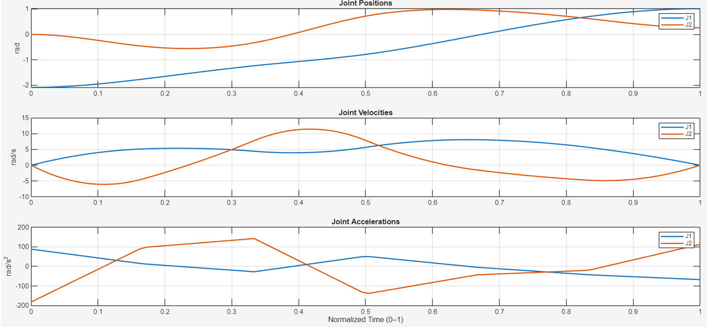
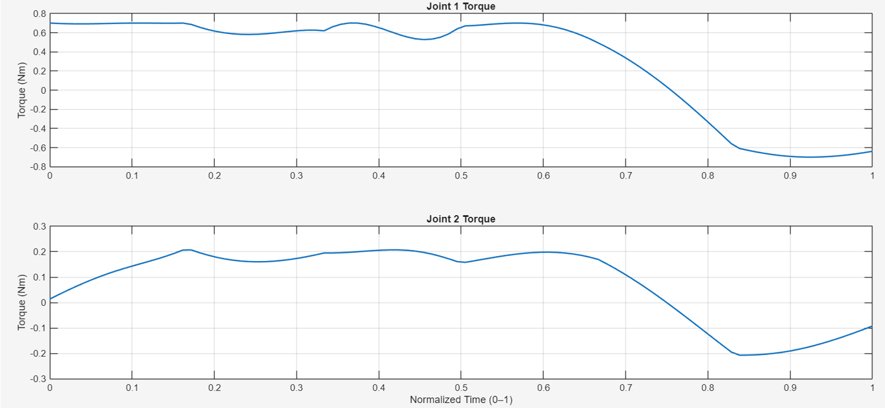

# Robotic Manipulator Trajectory Optimization

## Overview

This project presents a MATLAB-based framework for trajectory planning, inverse dynamics analysis, and time-optimal trajectory optimization of a 2R robotic manipulator.

The objective is to generate smooth joint trajectories between specified start and end configurations while minimizing execution time and ensuring that actuator torque limits are not violated.

The project combines trajectory generation, dynamic modeling, and nonlinear optimization to produce feasible and efficient robotic motion.

---

## Project Workflow

### Step 1: Trajectory Generation

**File:** `zvector_trajectorycomputer.m`

A cubic spline trajectory is generated between the initial and final joint configurations. The trajectory provides continuous position, velocity, and acceleration profiles for both joints.

### Step 2: Inverse Dynamics Analysis

**File:** `instant_torque_computer_galmani.m`

The manipulator dynamic model is used to compute the torques required at each joint.

The model considers:

* Link inertia
* Coriolis and centrifugal effects
* Gravitational loading

This allows evaluation of whether a planned motion can be executed by the actuators.

### Step 3: Time-Optimal Trajectory Optimization

**File:** `normalized_fminoptimization3.m`

The trajectory is optimized using Sequential Least Squares Programming (SLSQP) to minimize execution time while satisfying joint torque constraints.

The optimization searches for suitable internal trajectory points and final execution time that result in the fastest feasible motion.

---

## Results

### Joint Motion Profiles

The optimized trajectory produces smooth position, velocity, and acceleration profiles for both joints throughout the motion.

### Joint Torque Profiles

The computed torque profiles remain within the specified actuator limits while executing the optimized trajectory.

---

## Key Features

* Cubic spline trajectory generation
* Inverse dynamics torque computation
* Torque-constrained optimization
* Time-optimal motion planning
* MATLAB-based simulation and visualization

---

## Tools and Methods

* MATLAB
* Optimization Toolbox
* Cubic Spline Interpolation
* Sequential Least Squares Programming (SLSQP)
* Robot Dynamics Modeling

---

## My Contributions

* Developed trajectory generation algorithms for a 2R robotic manipulator
* Implemented inverse dynamics calculations for torque estimation
* Formulated and solved a time-optimal trajectory optimization problem
* Generated and analyzed motion and torque profiles
* Validated actuator torque constraints through simulation

---

## Team Information

* Team Size: 2 Members
* Project Type: Academic Robotics Project
